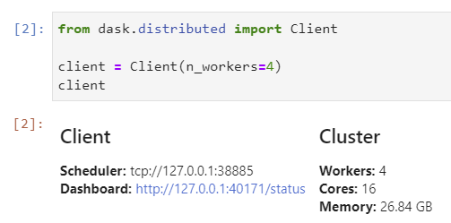

When you create a Dask client, you can head over to an url to see a dashboard of what is happening. Since Dask allows us to visualize what is happening under the hood, when using a notebook:
To do that, we need two things:

- [JupyterLab](https://jupyterlab.readthedocs.io/en/stable/getting_started/installation.html)
- [Dask lab extension](https://github.com/dask/dask-labextension)

By having the Dask Dashboard inside your notebook, you can use that to visualize any work that is being done. It can also help you diagnose performance issues that you might have with your code.

## Install

Throughout this article, I am going to be using conda to install dependencies and manage my environments. You can use pip as well if you prefer.

First, let's install JupyterLab if you haven't installed already.

```shell
conda install -c conda-forge jupyterlab
```

The Dask extension will need you to install nodejs. Install nodeJs from conda-forge because this will install the latest node version - the one from conda is a few versions behind.

```
conda install -c conda-forge nodejs
```

Then we need to install the Dask Extension 

```shell
conda install -c conda-forge dask-labextension
```

Once that is done, we have to build the extension with two commands

```shell
jupyter labextension install dask-labextension
jupyter serverextension enable dask\_labextension
```

## Configuration

By default, the extension will launch a local cluster, but it gives you the ability to both launch and manage other kinds of Dask clusters. If you are using a local cluster, you don't need to do anything else.

If you need to manage other kinds of clusters, then you will have to configure them accordingly from a yaml file. Please read the [README of the Extension](https://github.com/dask/dask-labextension) for more information on this matter.

### Start your JupyterLab notebook

The Dask extension is now installed, we will need a notebook to try out the extension. If you don't have one, a great place to start is by using the [Dask Tutorial](http://github.com/dask/dask\-tutorial) that you can clone from GitHub.

When you have a dask notebook, we can go ahead and start the JupyterLab notebook:

```shell
jupyter lab
```

You will get an URL that will look like `http://localhost:8888/?token=<token>` if you go to that URL, you will see the Dask extension on the left. 

To be able to use the extension, you first need to create a client with Dask which will give you a Dask dashboard URL.

```python
from dask.distributed import Client

client = Client(n_workers=4)
client
```

Most notebooks from the tutorial will contain this step, but you might need to add the `client` part, to get your dashboard URL. 



You can now use that URL `http://127.0.0.1:40171/status` on the Dask extension tab, the buttons will turn orange to say that you can now open new windows. The great thing about this extension is that you can move windows around and have your notebook on one side and all the diagnostics windows open around your notebook.

## Video
If you prefer to watch a video on how to install and use the Dask Extension, here's a great introduction from Matt.

<iframe 
    className="center"
    width="560" 
    height="315" 
    src="https://www.youtube.com/embed/EX_voquHdk0" 
    frameborder="0" 
    allow="accelerometer; autoplay; encrypted-media; gyroscope; picture-in-picture" 
    allowfullscreen 
/>