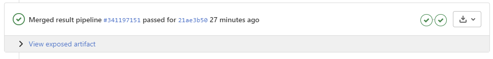

This article will help you set up Gitlab pages from a specific folder in your repository. Let's assume that your documentation is living inside your project repository and built using [Sphinx](https://www.sphinx-doc.org/).

To deploy your documentation site with Pages, you need to run a CI job to build the site. Gitlab will take care of the rest. You don't need to worry about domain names or Gitlab instance configurations if you do not use a dedicated Gitlab instance.

When your documentation is deployed, the URL will look similar to this `https://<username or organisation>.gitlab.io/<repo name>`

## Getting Gitlab CI setup

Pages will be deployed once the CI job finishes running. The good thing is that if you already have a CI flow setup, all you need to do is add another job to deploy the pages. If you don't have one, you might be interested in [reading about pages ci template](https://docs.gitlab.com/ee/user/project/pages/getting_started/pages_ci_cd_template.html).

Create a `.gitlab-ci.yaml` file at the root of your project. We will create two jobs to test if the documentation will build on every merge request and deploy your documentation from a branch called `production`.

Since the first job will run on every deployment, you will know if something is broken before deploying a new version of your documentation.

### Creating the first job - Testing the build

We are now ready to start working on our CI template. Let's assume that your documentation lives in a folder inside the root directory of your project and that you have a `requirements.txt` file with some dependencies, for example:

```
sphinx
sphinx-copybutton
sphinxawesome-theme
```

Let's create a `.gitlab-ci.yaml` file in the root directory of your project to install the requirements and run the build command to see if everything will build correctly.

```yaml
image: python:3.8-alpine

stages:
  - checks
  - deploy

test-docs:
  stage: checks
  script:
    - pip install -r requirements.txt
    - cd documentation
    - sphinx-build -b html . preview
  artifacts:
    expose_as: "docs-preview"
    paths:
      - preview/
```

import Note from "../../components/text-decorations/note"

The script portion of the job will install the dependencies and then build your docs in a `preview` folder.

The artifacts portion will allow Gitlab to expose the built docs to you so you can see a preview of your documentation. Gitlab will add a collapsed section to the CI pipeline status once the CI has finished so you can see the built.



<Note>

<p>
  If you struggle with building the pages, I recommend that you check the{" "}
  <a href="https://gitlab.com/pages" target="_blank" rel="noopener noreferrer">
    Gitlab examples websites
  </a>{" "}
  to see how to get your chosen static site deployed Gitlab.
</p>

</Note>

### Creating the second job - Deploying to pages

The second job will be similar to our `test-docs` one, with some minor changes. We will change the stage to deploy, we will add a rule to run the job only when it's added to the `production` branch, and we will call this job `pages`.

```yaml
pages:
  stage: deploy
  rules:
    - if: $CI_MERGE_REQUEST_SOURCE_BRANCH_NAME =~ /^production/
  script:
    - pip install -r requirements.txt
    - cd documentation
    - sphinx-build -b html . public
  artifacts:
    expose_as: "docs-deploy-preview"
    paths:
      - public/
```

Let's take a brief moment to talk about how Gitlab expects you to pass things, so it knows where to find your files. The job deployed to Gitlab pages has to have the name `pages`. But another thing that you need to do is that the files are located in the `public` folder.

Depending on your project, you might not want to run the deploy stage every time you commit to the production branch. You can change how the job starts by adding another rule `when: manual`. This means you will have to click the start icon to start the job manually.

```yaml
pages:
  stage: deploy
  rules:
    - if: $CI_MERGE_REQUEST_SOURCE_BRANCH_NAME =~ /^production/
      when: manual
  script:
    - pip install -r requirements.txt
    - cd documentation
    - sphinx-build -b html . public
  artifacts:
    expose_as: "docs-deploy-preview"
    paths:
      - public/
```

## Tie it all together

That's all there is to it. I hope this article was helpful for you, and hopefully, I have saved you some time. When I was trying to implement this, I found the Gitlab documentation confusing. It seems to focus more on setting up pages if you are not using a shared Gitlab instance and need to set up everything yourself.

Our finished `.gitlab-ci.yaml` file looks like this

```yaml
image: python:3.8-alpine

stages:
  - checks
  - deploy

test-docs:
  stage: checks
  script:
    - pip install -r requirements.txt
    - cd documentation
    - sphinx-build -b html . preview
  artifacts:
    expose_as: "docs-preview"
    paths:
      - preview/
pages:
  stage: deploy
  rules:
    - if: $CI_MERGE_REQUEST_SOURCE_BRANCH_NAME =~ /^production/
      when: manual
  script:
    - pip install -r requirements.txt
    - cd documentation
    - sphinx-build -b html . public
  artifacts:
    expose_as: "docs-deploy-preview"
    paths:
      - public/
```
