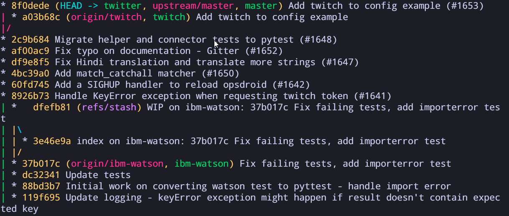

This article contains notes for the video from lesson 6 of [Missing Semester](https://www.youtube.com/channel/UCuXy5tCgEninup9cGplbiFw) on Version Control and git. I've taken notes of how git works and less about git commands and what they do. I hope these notes prove useful for you, at the bottom of the article you have some great references if you want to go more in-depth on your git learning.


<iframe 
    width="560" 
    height="315" 
    src="https://www.youtube.com/embed/2sjqTHE0zok" 
    frameborder="0" 
    allow="accelerometer; autoplay; encrypted-media; gyroscope; picture-in-picture" 
    allowfullscreen 
/>


Version control systems are tools to keep track of changes to source code or other collections of files and folders. They help to track the changes of documents and they make it easy collaborating with someone else.

It track changes in a series of snapshots and they contain the entire state of files or folders within a directory. They also add metadata that contains things like who created the snapshot, messages, changes, etc.

Version control is useful because it let you look at old snapshots of a project, keep a log of changes, work on different branches, see who wrote a specific line or who added a change and more.


## Git data model

Git has a data model that enables features of version control such as keeping track of changes in history, allowing branches and collaboration with other folks.

### Snapshots

A snapshot is what we know as a commit. It contains the history of files, folders and metadata. A snapshot is the top-level tree/directory that is being tracked.

> **Note:** We can track a top-level tree with the command `git init`

We can think of a snapshoot as being built like this:

```
type commit = struct {
	parent: array<commit>
	author: string
	message: string
	snapshot: tree
}
```

>**Note:** this is pseudo-code

In Git terminology, a file is called a "blob" because it's just a bunch of bytes. We can think of blobs as an array of bytes:

```
type blob = array<bytes>
```

A directory is called a tree. A tree, maps names to trees or blobs which means that a directory can contain other directories.

```
type tree = map<string, tree | blob>
```

### Objects and content-addressing

Even though we name each file, directory and commit differently, they are all objects. And git stores all this data as objects inside a content address store.

```
objects = map<string, objects>
```

This means that the core of git is a simple key-value data store. You can insert any object into your git storage and git will store it with a unique key.

This unique key is the [SHA-1 hash](https://en.wikipedia.org/wiki/SHA-1) of that object and it allows us to access the object with that key.

> **Note:** Using a hash allows us to take a big piece of data and turn it into a short string

Taking the example from that `git log` that I have shown before:

```
* 8f0dede (HEAD -> twitter, upstream/master, master) Add twitch to config example (#1653)
| * a03b68c (origin/twitch, twitch) Add twitch to config example
|/
* 2c9b684 Migrate helper and connector tests to pytest (#1648)
* af00ac9 Fix typo on documentation - Gitter (#1652)
```

If we want to access or reference the snapshot _"Migrate helper and connector tests to pytest"_ I can reference the first seven characters of that object hash: `af00ac9`.


## Git Branches
We can look at snapshots as to what we call  _commits_ in git, they contain all the changes done inside the directory. Each snapshot/commit points back to the one that precedes it.


Since all these snapshots point back to the previous one, we can this _history/line_ a branch. Usually, you will always have the main branch when you start tracking the changes of a folder with git.


Usually, this branch is the one that folks use to keep the latest version of a project. The powerful thing of git, is that it allows you to branch off from a specific snapshot/commit, so you can work with different branches of a commit and then merge them.



Here you can see the log of a project that I work on. You can see that each `*` is a snapshot, each line shows the _path_ that each snapshot took, you can also see the times that a branch was created and then merged back into the main one.


## References and Repositories

Now that we know that git objects can be identified by their SHA-1 hash and that snapshots live inside branches we can explore more about what is a reference inside git. 

A reference is a human-readable label to refer to a particular snapshot in history instead of using the whole SHA-1 hash.

```
references = map<string, string>
```


Let's look at the image from that `git log` that I used before. You can see things such as:
- `HEAD`
- `upstream/master`
- `master`
- `refs/stash`
- `origin/ibm-watson`
- `...`

There are all references that reference something. The `HEAD` means that this is the current commit that we are working on, `master` refers to the main branch while `upstream/master` is the main branch from the original repository for this project.

So what is a repository?

Putting very simply, a git repository contains all the objects and references. These repositories live inside our disk, but you could use services like GitHub, Gitlab or Bitbucket to save your repositories on these services. They also allow better collaboration with other folks and the reason why they become so popular.

## The Stating Area

The last thing that is worth to mention is that git has this concept of stating area. This is where you add files to this staging area to keep track of changes done and include them in your next snapshot.

By using the command `git status`, git tells you if you have any files that are currently untracked inside a project - these files will not be included on your next snapshot.

To include these files you can run the command `git add <name of the file>` or `git add .` to include all untracked files into the staging area.

After running that command you can type `git status` again and you will see your file names in green and bellow the text: _Changes to be committed:_

To create a new snapshot with these files in staging you need to run the command `git commit` which will open your text editor for you to choose a name for that snapshot. Alternatively, you can run the command `git commit -m "<message>"` to do it in a single command.


---
**References:**

- [Official course notes](https://missing.csail.mit.edu/2020/version-control/)
- [IncludeJS: Eva's lesson notes](https://includejs.dev/notes/missing-semester-06/)
- [The git object store](https://alexwlchan.net/a-plumbers-guide-to-git/1-the-git-object-store/)
- [Book: Pro Git - Free](https://git-scm.com/book/en/v2)
- [Git from the Bottom up](https://jwiegley.github.io/git-from-the-bottom-up/)