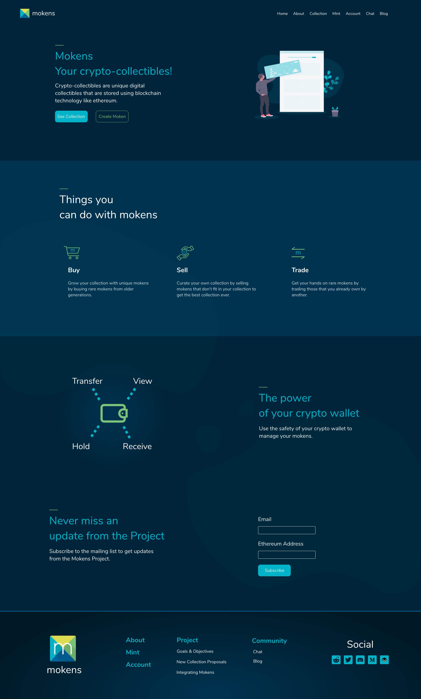
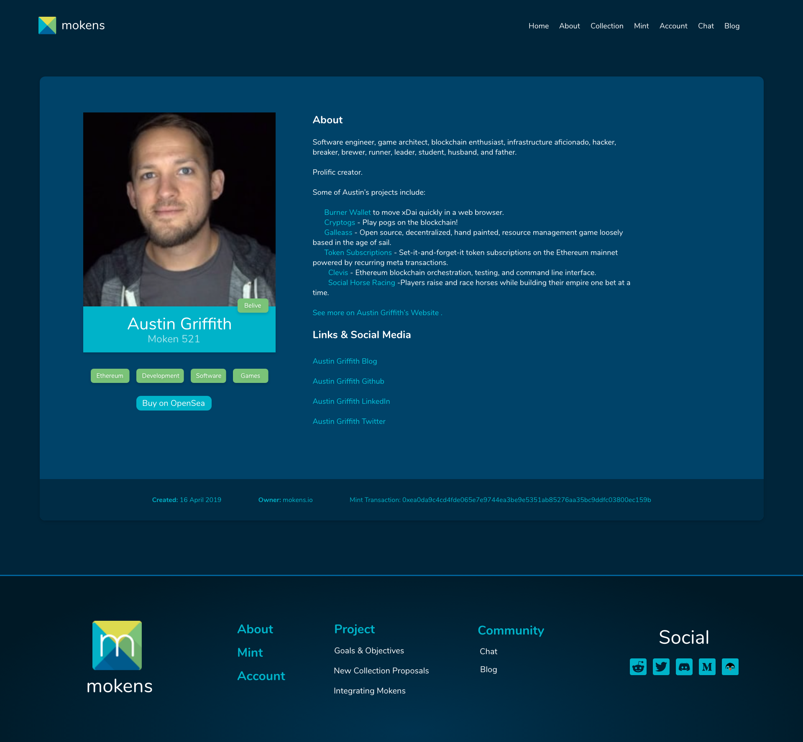
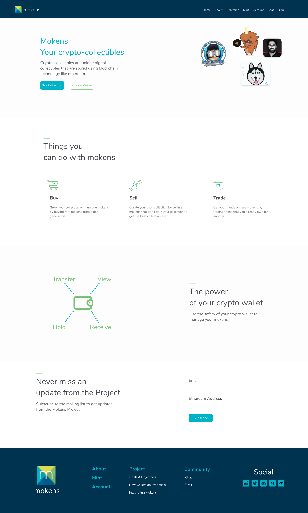
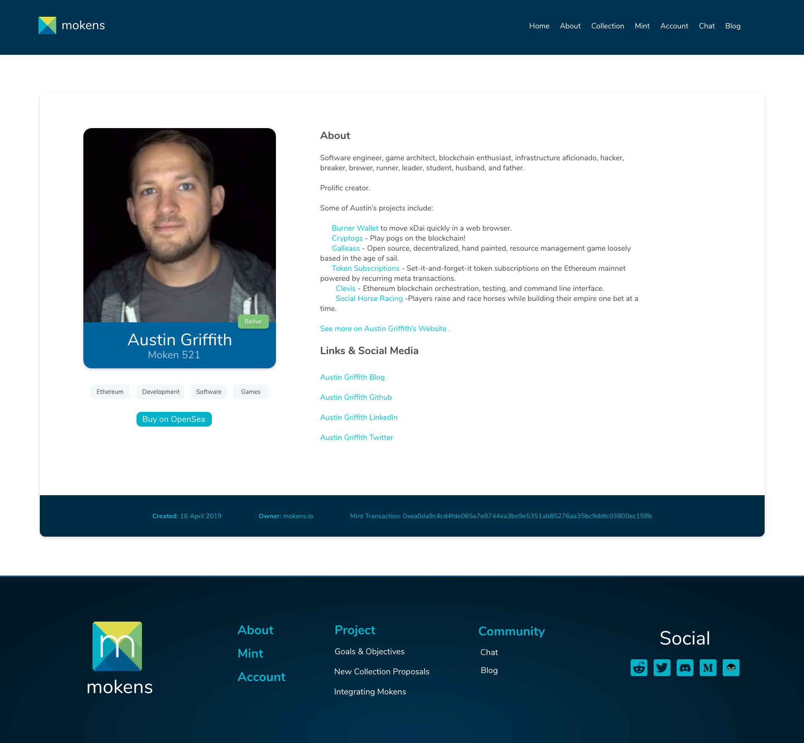
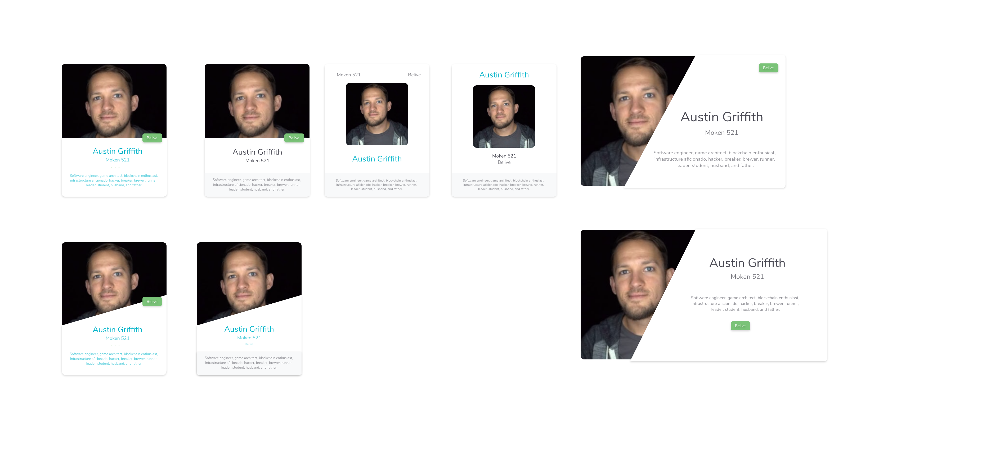

The client wanted a design for his project [Mokens](https://mokens.io), which are a digital creation that can be collected and can be viewed, held, transferred and received in crypto wallets.

After a few emails with the client, I proposed the dark theme for the page, the colours used in the design came from the Mokens logo that was already created. The design has grown gradually with the client input and eventually, the light theme was created because the client wanted the website to have the same feeling like another one.

Unfortunately, the client didn't want to go ahead with the full code of the website and decided to pay only for the design since he wasn't sure how he wanted the website to look like.

## Info

**Website:** [https://mokens.io/](https://mokens.io)

**GitHub repo:** Design proposal - no repo

## Images

Home Page - Dark Theme

Expanded Card Details - Dark Theme

Home Page - Light Theme

Expanded Card Details - Light Theme

Card Design Proposal

