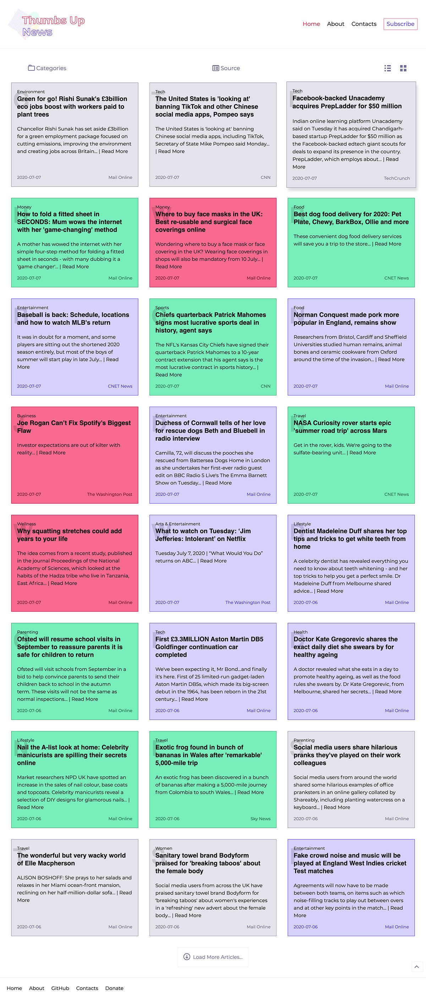
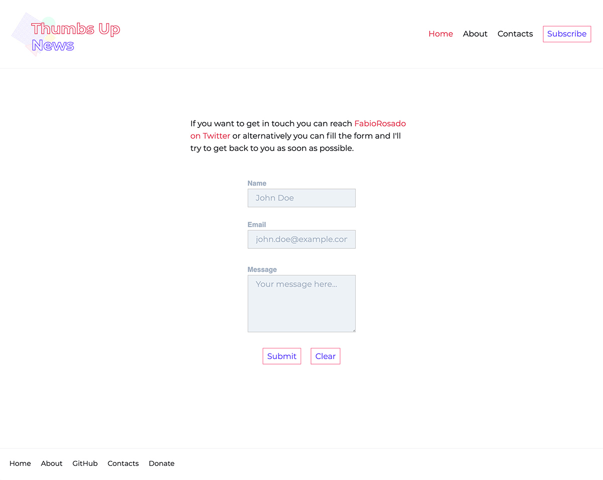
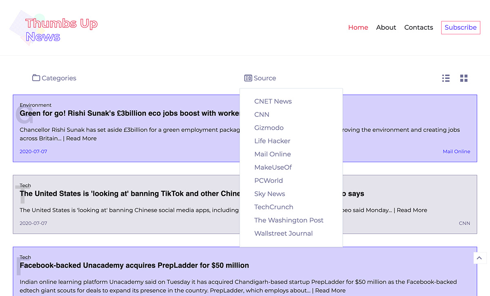

The idea for this project came to me when COVID-19 was starting to appear in Europe. A lot of news where just bad news and I was wondering if I could use the [Tweetnalytics](https://fabiorosado.dev/tweetnalytics) project to classify news headlines and filter the bad ones from the good ones. I've also taken the opportunity to use technology that I haven't used before and built the project on my Twitch channel - [TheFlyingDev](https://twitch.tv/theflyingdev).

Building the project was fun. Not only did I solve a lot of problems along the way, but I've also learned a lot about Django, Nginx, Docker and Nextjs. To scrape the news headlines I am using the python library Scrappy. On the backend, I am also using the Django Rest Framework to create a REST API that I will open to the public in the future.

This project evolved with time and there is still a lot of work to do. My main focus at the moment is working on the API and add authentication so users can register to the site and use the API on their projects. The second thing I would like to work is to choose the news websites better, some of the articles are hidden behind a paywall and that gives a bad user experience.

## Tech Stack

- Django for the backend
- Nextjs for the frontend
- Nginx for server management
- certbot for ssl certificates
- Docker compose

## Info

**Website:** [https://thumbsupnews.net/](https://thumbsupnews.net/)

**GitHub repo:** [Thumbsupnews Repository](https://github.com/FabioRosado/thumbsupnews)

## Images

Thumbsupnews Home Page

Thumbsupnews Contact Page

Thumbsupnews Home Page List view

