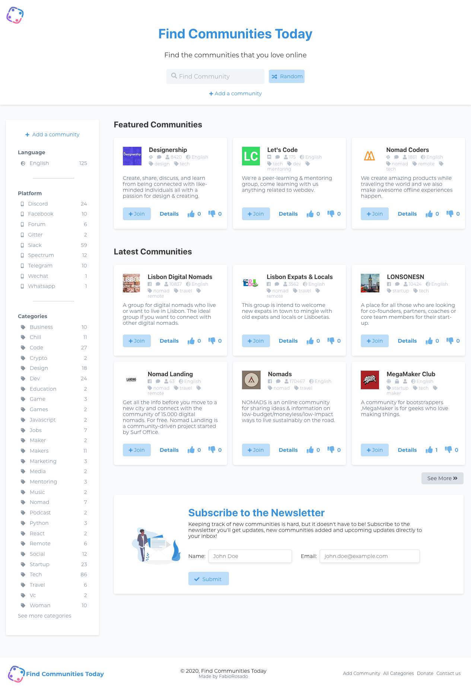
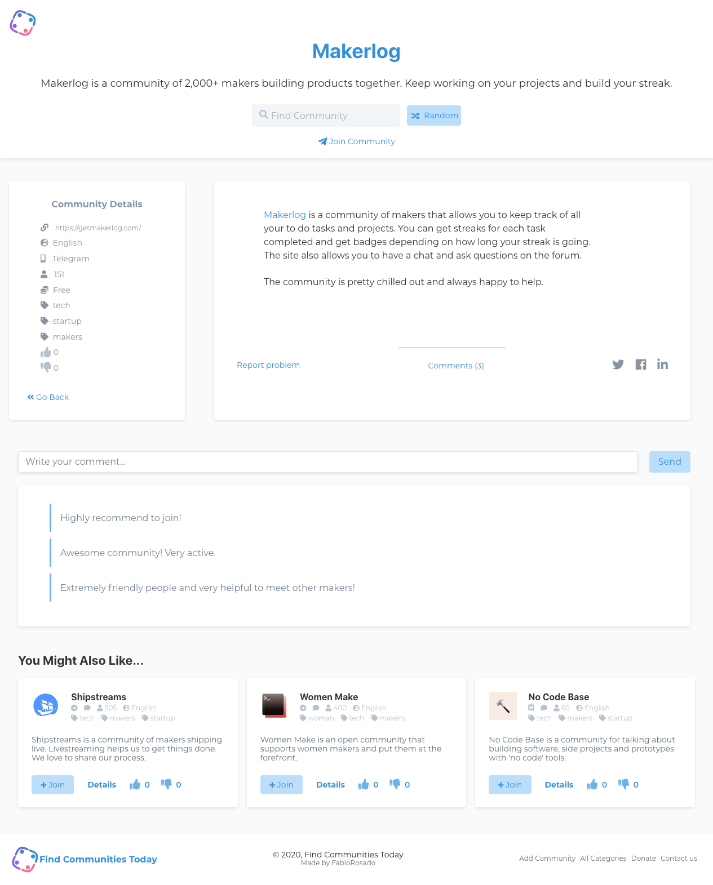
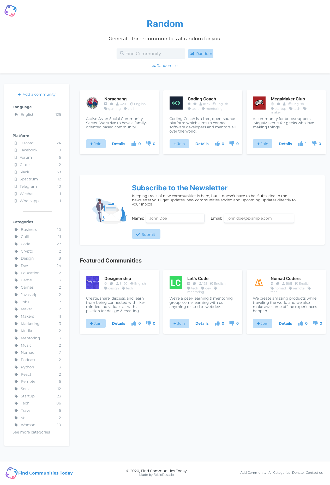
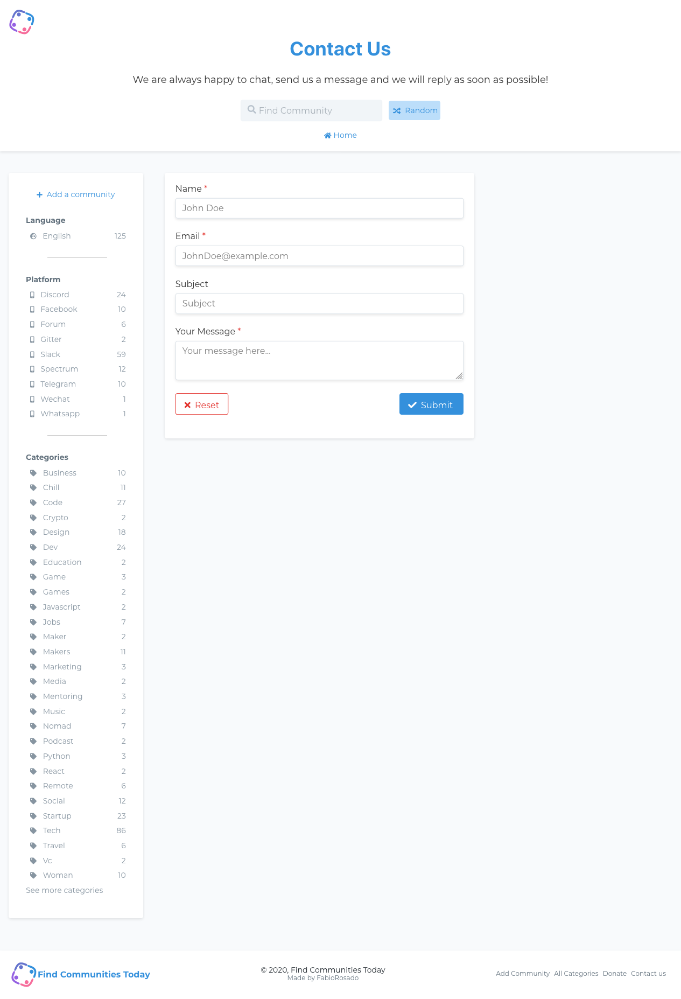

Find Communities Today was a project that I created to learn React. I've used Gatsby, TailwindCss, Airtable and MongoDB to create this website. It was really fun working on this and I've learned a lot.

The site grew gradually. Initially, it was just a list of communities, then I added the search bar, then the pagination on the home page, then the random generator and finally the like/dislike and comment system.

All the forms on the website are connected to Airtable and after submitting communities to Airtable, the process of moving the data from airtable to a markdown file took forever, so I wrote a quick python script using Jinja2 to get the data from Airtable and automatically create the markdown file on the communities folder.

Unfortunately, this project didn't grow as much as I wanted - mostly due to the fact that I haven't really done any marketing for it. Still, it gets an occasional visit from time to time and that's why I keep it running.

# Overview

- **The Good**
  - Users are able to vote and comment on a community
  - Created a script that gets data from airtable and turn into a markdown file that adds the community to the list
  - Offers a nice appealing way to browse communities and even suggests communities related to the one open.
- **The Bad**
  - Choosing a platform will just throw all the communities in that category - pagination would improve the look
  - Viewing all categories page loads a page with two columns - this page doesn't look very appealing
  - Adding/updating featured communities needs to be done manually on frontmatter for each community.
- **The Ugly**
  - Community links that are too long break the sidebar a bit - should just create a redirect link
  - Liking/Disliking a community from the sidebar doesn't add the vote on the page - but does on the db

# Info

**Website:** [https://findcommunities.today/](https://findcommunities.today/)

**GitHub repo:** Private Repository

# Images

Home Page

Community Page

Random Communities Page

Contact Page

