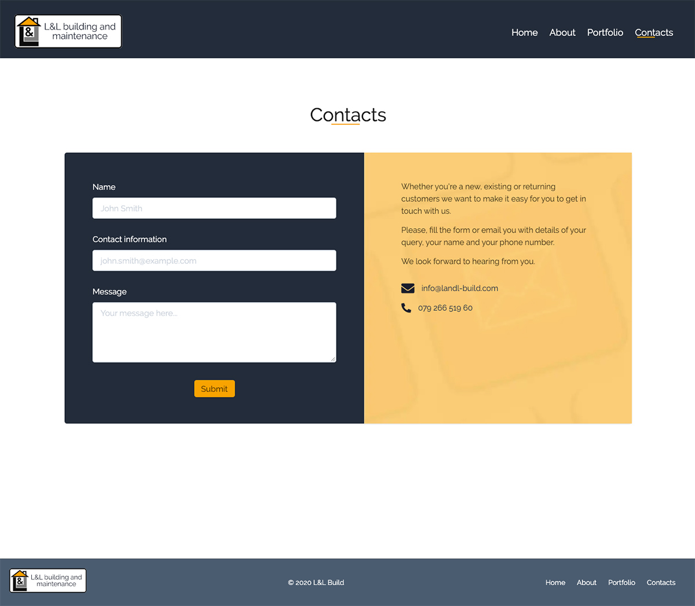

The client asked to design and code a website for their building company, the client already had bought the domain and had the logo printed on business cards.

My initial idea for the client was to use something very minimalist. But after talking with the client it was clear that this wasn't exactly what the client imagined the site to be. So we kept on talking and revising the design until the client was happy with the result.

The client wanted to have a contact form that could send an email to their email address when someone tried to contact the company - this could also keep the volume of the calls down. I decided to use a serverless function to use the mailgun api to send the form data through email.

The client also wanted an easy way to add new pictures and work done to the site and the decision was made to use contentful to source all the media onto the website.

# Info

**Website:** [https://www.landl-build.com/](https://www.landl-build.com/)

**GitHub repo:** Private

# Images

First proposal

LandL Build Home Page

LandL Build About Page

LandL Build Portfolio Page

LandL Build Contact Page

LandL Build Portfolio Item Page

